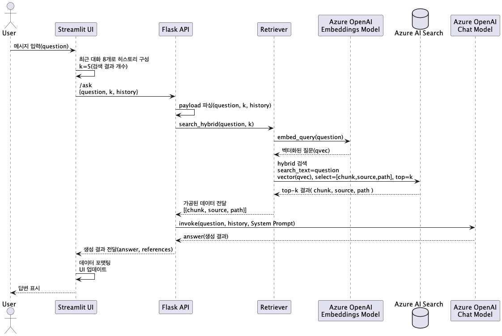

# KT STB DevDocs Agent

KT 셋톱박스(STB) 관련 개발 문서를 Azure OpenAI + Azure AI Search 기반으로 검색·요약해 주는 문서 어시스턴트입니다. 하이브리드 검색으로 관련 문서를 찾고, LLM이 한국어로 핵심 절차와 샘플 코드를 정리해 줍니다.

## 주요 기능
- **문서 검색**: Azure AI Search 하이브리드(Vector + Keyword) 검색으로 규격서/가이드를 탐색.
- **LLM 응답 생성**: Azure OpenAI Chat 모델이 한국어 답변, 절차, 샘플 코드를 생성.
- **근거 문서 제시**: 응답과 함께 참조한 문서명을 UI에서 하이퍼링크로 제공.
- **대화 히스토리 유지**: 최근 대화 8개를 기반으로 후속 질의 맥락 반영.
- **Streamlit UI**: 브라우저에서 챗 UI로 질문·응답을 확인하고 참고문헌 확인.

## 시스템 구성
| 구성 요소 | 경로 | 설명 |
| --- | --- | --- |
| Flask API | `src/app/main.py` | `/ask` 엔드포인트에서 검색→생성 워크플로우 실행 |
| Retriever | `src/app/retriever.py` | Azure AI Search 하이브리드 검색 래퍼 |
| RAG Chain | `src/app/rag_chain.py` | 검색 결과 컨텍스트 구성 후 Azure Chat 호출 |
| Prompt | `src/app/prompts/system_ko.md` | 한국어 시스템 프롬프트(응답 규칙) |
| Streamlit UI | `src/ui/streamlit_app.py` | 웹 UI, 대화 세션/참고문헌 렌더링 |
| 문서 저장소 | `docs/` | STB 관련 PDF 문서 원본 |

## 요구 사항
- Python 3.11 이상
- Azure OpenAI 리소스 (Chat, Embedding 배포)
- Azure AI Search 리소스 및 인덱스 (문서 업로드/색인 완료)
- 선택: [uv](https://github.com/astral-sh/uv) (가상환경 및 패키지 관리 용도)

## 빠른 시작
```bash
# 1. uv 설치
pip install uv

# 2. 가상환경 생성 및 활성화
uv venv .venv
source .venv/bin/activate

# 3. 의존성 설치
uv sync          # uv.lock 기반 설치

# 4. 환경 변수 파일 준비
touch .env
```

## 환경 변수
루트에 `.env` 파일을 두고 아래 값을 채운다.

| 키 | 설명 |
| --- | --- |
| `AZURE_OPENAI_ENDPOINT` | Azure OpenAI 리소스 엔드포인트 URL |
| `AZURE_OPENAI_API_KEY` | Azure OpenAI API Key |
| `AZURE_OPENAI_API_VERSION` | 사용할 API 버전 (예: `2024-12-01-preview`) |
| `AZURE_OPENAI_CHAT_DEPLOYMENT` | Chat 모델 배포 이름 (예: `gpt-4.1-mini`) |
| `AZURE_OPENAI_EMBEDDING_DEPLOYMENT` | Embedding 모델 배포 이름 |
| `AZURE_SEARCH_ENDPOINT` | Azure AI Search 엔드포인트 |
| `AZURE_SEARCH_API_KEY` | Azure AI Search 키 |
| `AZURE_SEARCH_INDEX` | 검색 대상 인덱스 이름 |
| `FLASK_HOST` / `FLASK_PORT` | 백엔드 바인딩 주소/포트 (기본 `0.0.0.0:8000`) |
| `API_URL` | Streamlit UI가 호출할 API 주소 (기본 `http://localhost:8000/ask`) |
| `RETRIEVAL_TOPK` | 검색 상위 문서 수 (기본 5) |

## 실행 방법
### 1. 백엔드 API (Flask)
```bash
uv run python -m src.app.main
# 또는
python -m src.app.main
```

### 2. Streamlit UI
```bash
uv run streamlit run src/ui/streamlit_app.py
# 또는
streamlit run src/ui/streamlit_app.py
```

## Azure 리소스 준비
1. **리소스 그룹**: 동일 지역(예: Korea Central)에 리소스를 모아 관리.
2. **Azure OpenAI**: Azure AI Foundry에서 Chat(`gpt-4.1-mini`)과 Embedding(`text-embedding-3-small`) 모델을 각각 배포.
3. **Azure AI Search**: 기본(Basic) 요금제 이상으로 생성하고 관리 키를 확보.
4. **Azure Storage**: 규격서/PDF를 업로드할 Blob 컨테이너 생성.
5. **환경 변수 등록**: 위 리소스의 Endpoint/Key/배포 이름을 `.env`와 App Service 설정에 동일하게 입력.

## Azure AI Search 색인 구성
1. Blob 컨테이너에 STB 문서를 업로드한다(`docs/` 폴더 내용 참고).
2. Azure AI Search 포털에서 **데이터 소스 → 스킬셋 → 인덱스** 순으로 "RAG" 템플릿을 사용해 파이프라인을 만든다.
3. 인덱스 스키마에 `source`, `path`, `title`, `contentVector` 등을 포함하고 필요 시 사용자 정의 필드를 추가한다.
4. 스킬셋 출력 매핑에도 `source`, `path`를 연결해 문서 출처를 유지한다.
5. 인덱싱을 실행하고 결과가 반영되었는지 Search 탐색기에서 질의로 확인한다.
6. 인덱스 이름과 관리 키를 `.env`에 기입한다(`AZURE_SEARCH_INDEX`, `AZURE_SEARCH_API_KEY`).

## 프로젝트 구조
```
.
├── docs/                      # STB 관련 PDF 원문(참고용)
├── setting_docs/              # 구축 단계별 가이드(README랑 겹침..)
├── src/
│   ├── app/
│   │   ├── main.py            # Flask 엔트리포인트
│   │   ├── config.py          # .env 로드 및 설정 객체
│   │   ├── retriever.py       # Azure Search 하이브리드 검색
│   │   ├── rag_chain.py       # 검색 컨텍스트 구성 + LLM 호출
│   │   └── prompts/system_ko.md
│   └── ui/
│       └── streamlit_app.py   # 챗 UI
├── pyproject.toml             # 프로젝트 메타/의존성
├── uv.lock                    # uv 잠금파일
└── README.md
```

## Azure Portal 배포(App Service)
### 1. 공통 설정
- App Service 런타임: Python 3.11(Linux), 플랜은 B1 이상 권장.
- 지역은 다른 리소스와 동일하게 맞추고, 네트워크 정책이 있다면 가상 네트워크 통합을 검토한다.
- **지속적 배포**: 배포 탭에서 GitHub를 연결하면 `main` 브랜치 푸시 시 자동으로 빌드/배포된다.

### 2. API(App Service A)
1. App Service를 생성한 뒤 **설정 → 구성 → 애플리케이션 설정**에 `.env` 값들을 그대로 추가한다.
2. `API_URL`은 UI 앱에서 사용하므로 굳이 입력하지 않아도 된다.
3. **시작 명령**에 다음을 입력한다.
   ```
   gunicorn -w 2 -k gthread -t 120 -b 0.0.0.0:8000 src.app.main:app
   ```
4. 저장 후 앱을 재시작하고 `https://{API-도메인}/health`로 헬스체크를 확인한다.

### 3. UI(App Service B)
1. 동일 플랜으로 별도 App Service를 만들고 GitHub 연동을 활성화한다.
2. **애플리케이션 설정**에 `API_URL=https://{API-도메인}/ask`를 포함해 API 엔드포인트를 명시한다.
3. Streamlit에서 사용하는 필수 환경변수가 있다면 이곳에 함께 정의한다.
4. **시작 명령**은 다음과 같이 지정한다.
   ```
   streamlit run src/ui/streamlit_app.py --server.port 8000 --server.address 0.0.0.0
   ```
5. 배포 후 `https://{UI-도메인}` 접속과 API 호출이 정상 동작하는지 확인한다.

### 4. 운영 체크리스트
- App Service `Always On`을 활성화해 워커 슬립을 방지한다.
- Azure Monitor 또는 Application Insights를 연동해 오류/성능 로그를 수집한다.
- Scale-out이 필요하면 App Service 플랜의 수평 확장 슬라이더로 인스턴스를 조정한다.
- 장애 대비를 위해 주요 환경 변수와 Search 인덱스 구성을 IaC(Bicep/Terraform)로 추출해 두는 것을 권장한다.

## 커스터마이징
- 프롬프트 수정: `src/app/prompts/system_ko.md`에서 응답 스타일과 정책을 조정합니다.
- 검색 파라미터: `RETRIEVAL_TOPK`, `search_hybrid()` 함수의 `max_chars` 등으로 응답 길이와 맥락을 제어 가능.
- UI 확장: Streamlit 컴포넌트를 활용해 답변 요약, 필터 등을 추가할 수 있다.

## 시퀀스 다이어그램

